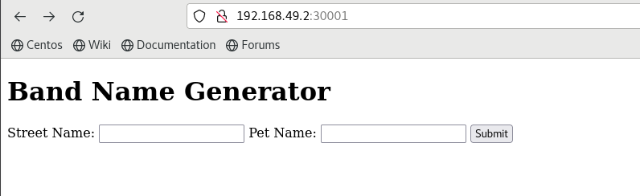
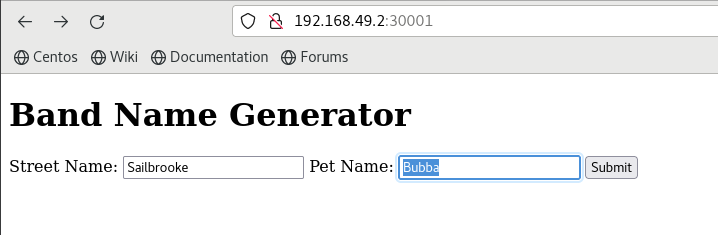
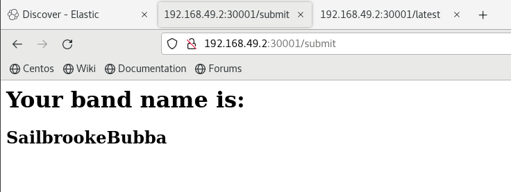
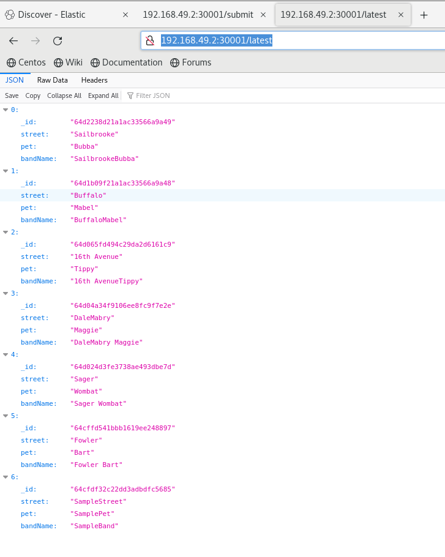
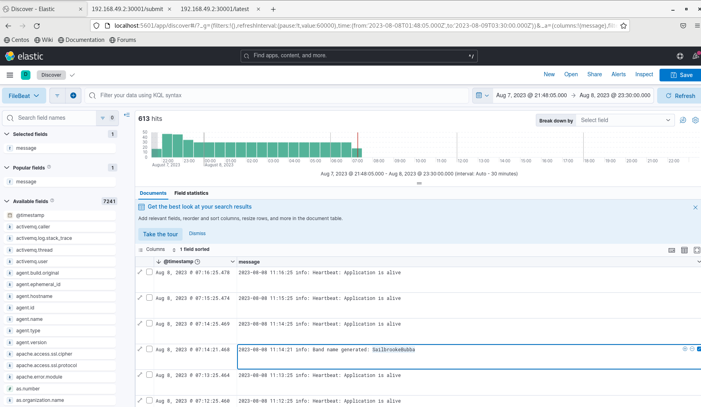

# Band Name Creator

## Overview

The Band Name Creator is a full-stack application designed to provide a unique and engaging experience for musicians, artists, and creative minds looking to generate a band name. Utilizing a combination of user input and intelligent algorithms, the application crafts memorable and distinctive band names that resonate with the user's personal style and preferences.

### Features

1. **User-Friendly Interface**: A simple and intuitive interface that prompts users to enter a street name and pet name, forming the basis for the band name creation.

2. **Intelligent Name Generation**: The application employs a creative algorithm that combines user input with a curated database of words and phrases to generate band names that are both meaningful and original.

3. **Database Integration**: All generated band names are stored in a MongoDB database, allowing for historical tracking and analysis.

4. **Real-Time Analytics**: Integration with the Elastic (ELK) stack provides real-time logging and analysis, enabling users to explore trends and insights related to band name creation.

5. **Responsive Web Endpoints**: The application offers web endpoints for listing the latest additions to the database, providing additional functionality and interaction.

6. **Containerized Deployment**: Utilizing Docker and Kubernetes, the Band Name Creator is designed for scalable and efficient deployment across various environments.

### Technology Stack

- **Frontend**: A responsive web interface built with modern web technologies.
- **Backend**: A robust backend powered by Node.js, handling user requests and managing the band name generation logic.
- **Database**: MongoDB, providing a scalable and efficient data storage solution.
- **Logging and Analysis**: Elastic (ELK) stack and FileBeat for real-time logging, monitoring, and analysis.
- **Containerization and Orchestration**: Docker and Kubernetes (Minikube) for containerized deployment and orchestration.

## Usage

The Band Name Creator is accessible through a web browser, where users are greeted with a form to enter a street name and pet name. Upon submission, the application generates a band name and displays it to the user. Additional endpoints provide access to the latest band names and other functionalities.

### Screenshots

#### Prompt to Enter Street Name and Pet Name



#### Reply to Submitting the Form


#### Web Endpoint GET Request to /listing


#### Discover Page in Kibana


## Tools Used

### OS
```bash
$ cat /etc/centos-release
CentOS Linux release 7.9.2009 (Core)

Version Control
bash
Copy code
$ git --version
git version 2.41.0
IDE
WebStorm 2023.2

Logging and Analysis
Elastic (ELK) stack

json
Copy code
$ curl -X GET "localhost:9200/"
{
  "name" : "localhost.localdomain",
  "cluster_name" : "elasticsearch",
  "cluster_uuid" : "7oGIpRkSQ66P3gfOQQIt4w",
  "version" : {
    "number" : "8.9.0",
    "build_flavor" : "default",
    "build_type" : "rpm",
    "build_hash" : "8aa461beb06aa0417a231c345a1b8c38fb498a0d",
    "build_date" : "2023-07-19T14:43:58.555259655Z",
    "build_snapshot" : false,
    "lucene_version" : "9.7.0",
    "minimum_wire_compatibility_version" : "7.17.0",
    "minimum_index_compatibility_version" : "7.0.0"
  },
  "tagline" : "You Know, for Search"
}
FileBeat
bash
Copy code
kubectl exec -it filebeat-jkbbg -n kube-system -- filebeat version
filebeat version 8.9.0 (amd64), libbeat 8.9.0 [dd50d49baeb99e0d21a31adb621908a7f0091046 built 2023-07-19 01:28:34 +0000 UTC]
Containerization
bash
Copy code
$ docker --version
Docker version 24.0.5, build ced0996
Orchestration
bash
Copy code
$ minikube version
minikube version: v1.31.1
commit: fd3f3801765d093a485d255043149f92ec0a695f

$ kubectl version --short
Flag --short has been deprecated, and will be removed in the future. The --short output will become the default.
Client Version: v1.27.4
Kustomize Version: v5.0.1
Server Version: v1.27.3
Database
Mongo running on Docker

bash
Copy code
$ docker exec -it mongodb  mongo --eval "printjson(db.version())"
MongoDB shell version v4.4.23
connecting to: mongodb://127.0.0.1:27017/?compressors=disabled&gssapiServiceName=mongodb
Implicit session: session { "id" : UUID("bfe739d4-2e47-48a5-a35c-974286688947") }
MongoDB server version: 4.4.23
"4.4.23"
Runtime for Application Container
bash
Copy code
$ node
Welcome to Node.js v14.21.3.
Conclusion
The Band Name Creator is a comprehensive full-stack project that showcases the integration of various technologies to create a cohesive and engaging application. Whether you're a musician looking for inspiration or a developer interested in exploring a multifaceted project, the Band Name Creator offers a unique blend of creativity and technical prowess.
